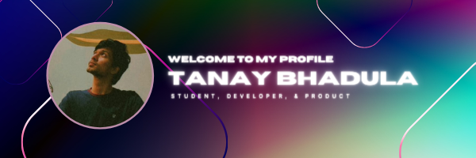

## Hi folks! 
## I am [Tanay Bhadula](https://github.com/TanayBhadula)

I am currently pursuing my B.Tech in Computer Science from Vellore Institute of Technology, Chennai.

 ### Connect with me:

[][linkedin]
[][twitter]
[][mail]

 

### Languages and Tools:

 
 

---

### :zap: GitHub Stats

    

[linkedin]: https://www.linkedin.com/in/tanay-bhadula/
[twitter]: https://www.instagram.com/tanaybhadula/
[mail]: mailto:tanaybhadula2002@gmail.com 

 

